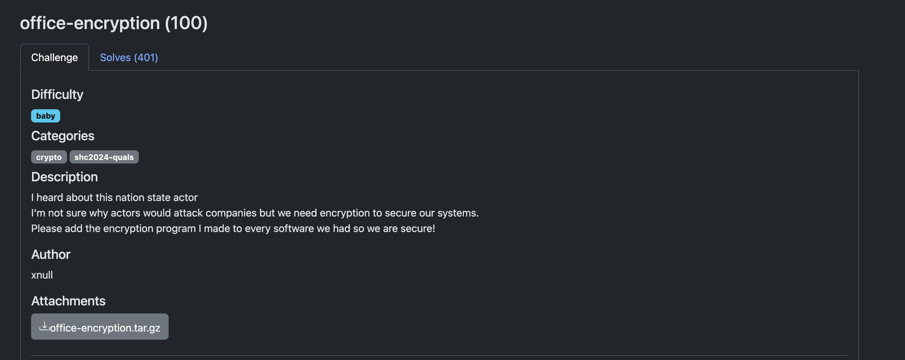
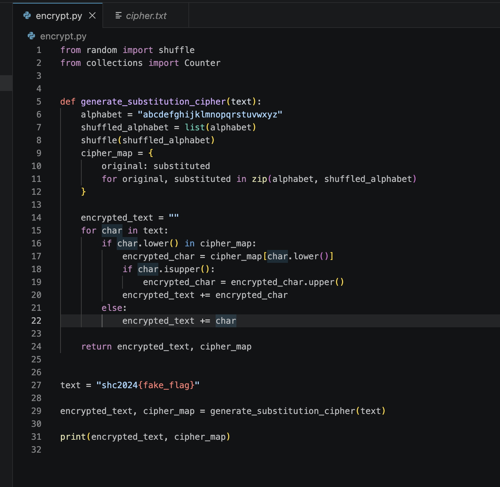

## Challenge Description


We are given a Python script (`encrypt.py`) that encrypts a string using a **random substitution cipher**, where each letter of the alphabet is replaced with another unique letter.

We are also given:
- Encrypted text:
    
    swo2024{jytmm_ruvs_opgbzu_mum}
    
- A substitution mapping (`cipher_map.txt`) that shows how each original letter was replaced.
```
{'a': 'k', 'b': 'n', 'c': 'o', 'd': 'r', 'e': 'v', 'f': 'q', 'g': 'i', 'h': 'w', 'i': 'x', 'j': 'd', 'k': 'h', 'l': 'm', 'm': 'l', 'n': 'y', 'o': 'u', 'p': 'b', 'q': 'f', 'r': 'p', 's': 's', 't': 'z', 'u': 't', 'v': 'a', 'w': 'c', 'x': 'j', 'y': 'g', 'z': 'e'}
```

The script works by:

- Shuffling the alphabet randomly
- Creating a mapping from original → substituted characters
- Replacing each character in the input text using this mapping

Example:

```
a → k
b → n
c → o
...
```

Since the mapping is provided, we can reverse it:
Then apply it to the ciphertext.

Example:
```
- `swo` → `shc`
- `jytmm` → `xnull`
- `ruvs` → `does`
- `opgbzu` → `crypto`
- `mum` → `lol`
```

```python
cipher_text = "swo2024{jytmm_ruvs_opgbzu_mum}"

cipher_map = {
    'a': 'k', 'b': 'n', 'c': 'o', 'd': 'r', 'e': 'v', 'f': 'q',
    'g': 'i', 'h': 'w', 'i': 'x', 'j': 'd', 'k': 'h', 'l': 'm',
    'm': 'l', 'n': 'y', 'o': 'u', 'p': 'b', 'q': 'f', 'r': 'p',
    's': 's', 't': 'z', 'u': 't', 'v': 'a', 'w': 'c', 'x': 'j',
    'y': 'g', 'z': 'e'
}

# Reverse the mapping (encrypted → original)
reverse_map = {v: k for k, v in cipher_map.items()}

# Decrypt
decrypted = ""
for char in cipher_text:
    if char.lower() in reverse_map:
        dec_char = reverse_map[char.lower()]
        if char.isupper():
            dec_char = dec_char.upper()
        decrypted += dec_char
    else:
        decrypted += char

print(decrypted)

```
We can use this script to decrypt the flag.
