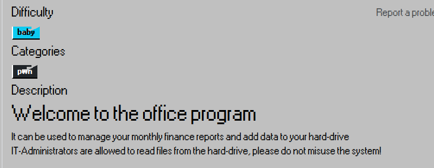
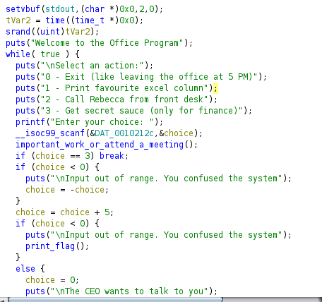
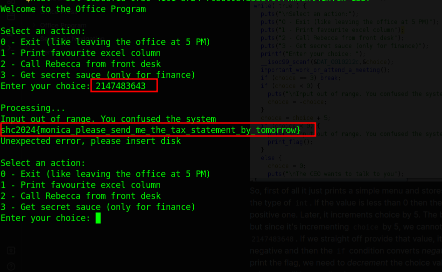

## Category: Pwn

# Description

We are given the binary only, let's fire up Ghidra to begin analyzing the binary.

First, it prints a simple menu and stores the choice in the `choice` variable with the type of `int`. If the value is less than 0, the `if` condition converts the negative `choice` to a positive one. Later, it increments the choice by 5. 

The bug here is that we can overflow the integer, but since it's incrementing `choice` by 5, we cannot directly provide an overflowed value like `2147483648`. If we provide that value directly, it will overflow and convert to negative. Then, the `if` condition converts the negative choice to positive, so to print the flag, we need to decrement the choice value by 5 before it overflows. The value we will be sending is `2147483643`.

`Flag: shc2024{monica_please_send_me_the_tax_statement_by_tomorrow}`
