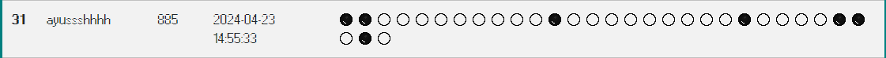

# Swiss Hacking Challenge 2024 Qualifiers

The **Swiss Hacking Challenge (SHC)** is the annual National Hacking Championship of Switzerland. If you enjoy Capture the Flag (CTF), hacking, and cyber security, this is the event for you! 

For more information about the options for qualifying, pictures from past editions, and the people behind the Swiss Hacking Challenge, please visit the [Swiss Hacking Challenge Homepage](https://swisshacking.ch).

## Qualifier Details

- **Start**: 01.03.2024 at 18:00 CET (UTC+1)
- **End**: 30.04.2024 at 23:59 CEST (UTC+2)

The qualifier runs for two months, offering plenty of time for participants to showcase their skills.

## My Participation

I participated in the Swiss Hacking Challenge 2024 qualifiers for fun, not for selection, and I achieved an impressive **rank 31** in the open division! It was an amazing experience, and I look forward to participating again in the future.

## Thanks for Reading!

