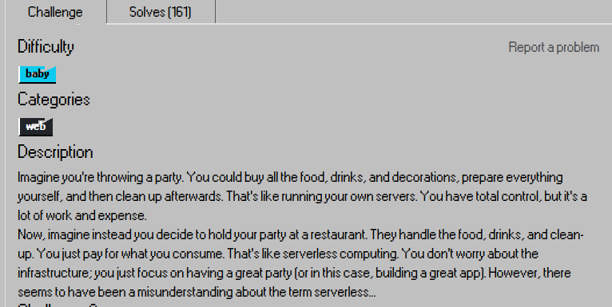
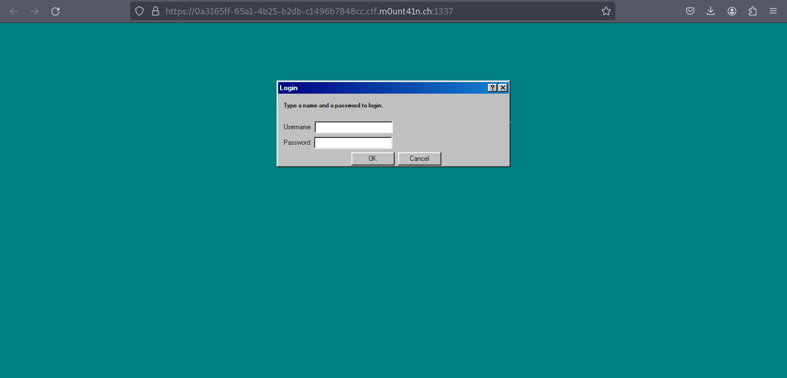
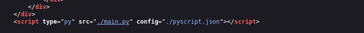
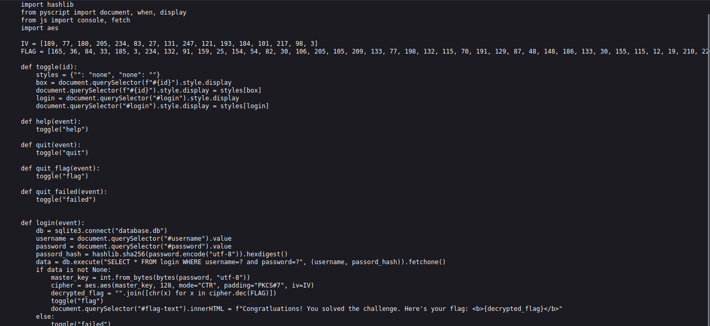
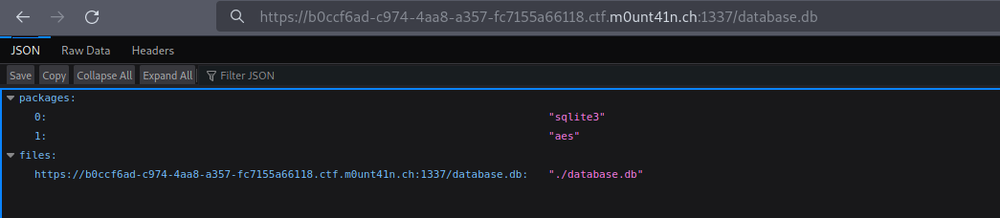
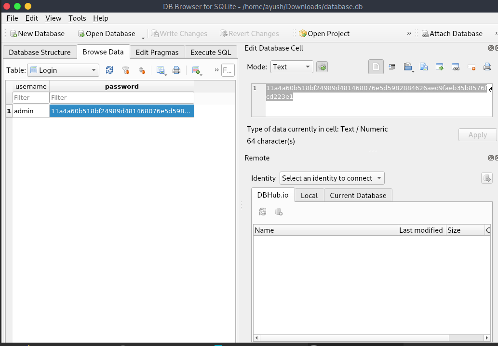
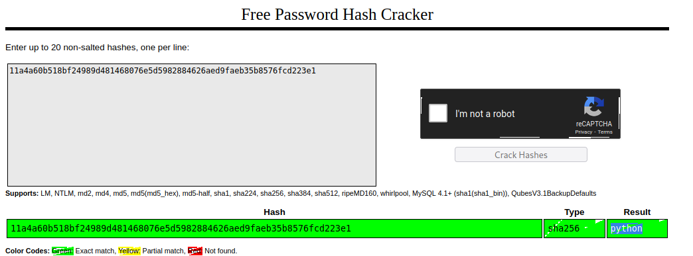
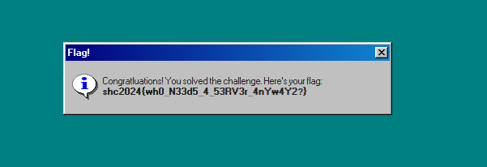

## Challenge Description

## Login Page

## Viewing Source Code

`main.py` contains the server code and `pyscript.json` includes the configurations.

Looking at `main.py`, we can see that we need a valid username and password to get authenticated and get the flag, because the query is parameterized, and without a master key, we won't be able to decrypt the flag.

## `pyscript.json`

It shows the path to `database.db`, can we access it? The answer is yes, we can.

## Opening DB in `sqlite3` browser

It is a `sha256` hash, so let's try to crack the hash using [crackstation.net](https://crackstation.net).

It's cracked easily: `python`

## Flag

After authenticating with `admin` and the `python` as the credentials, we get the flag.

