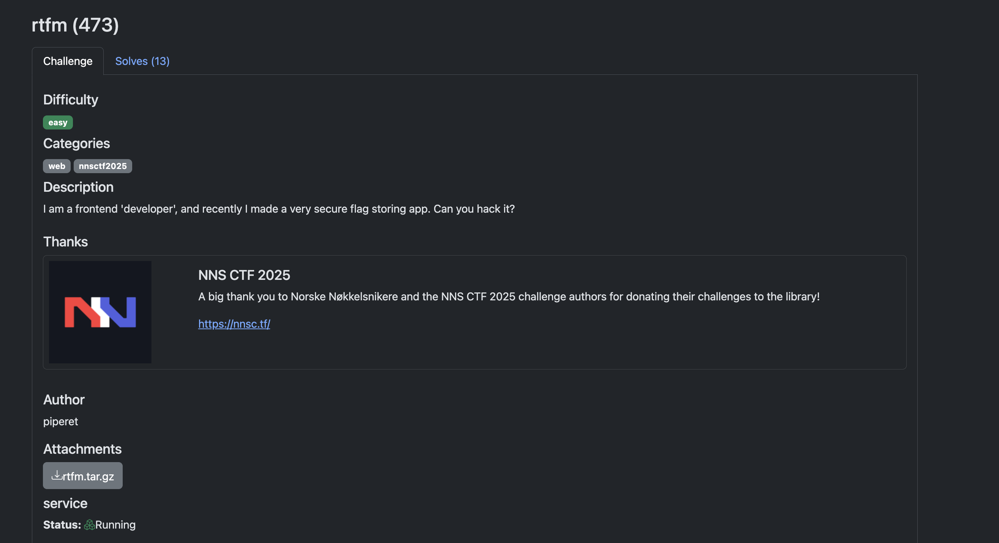
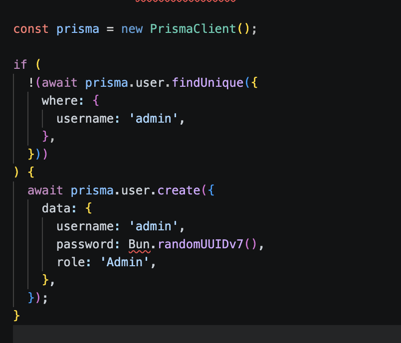
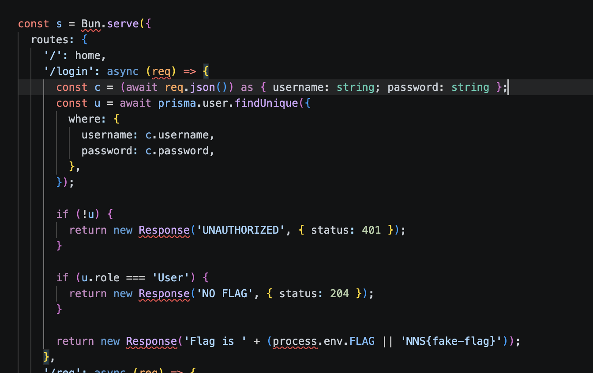
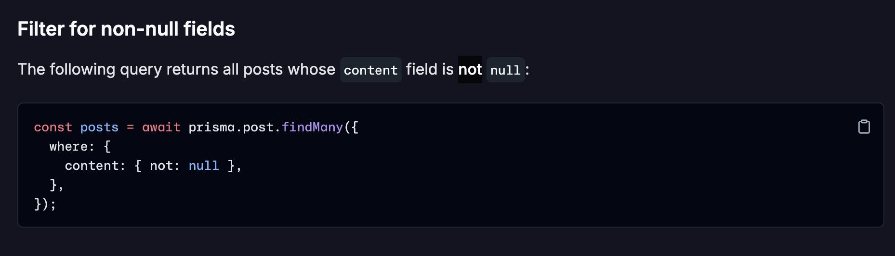
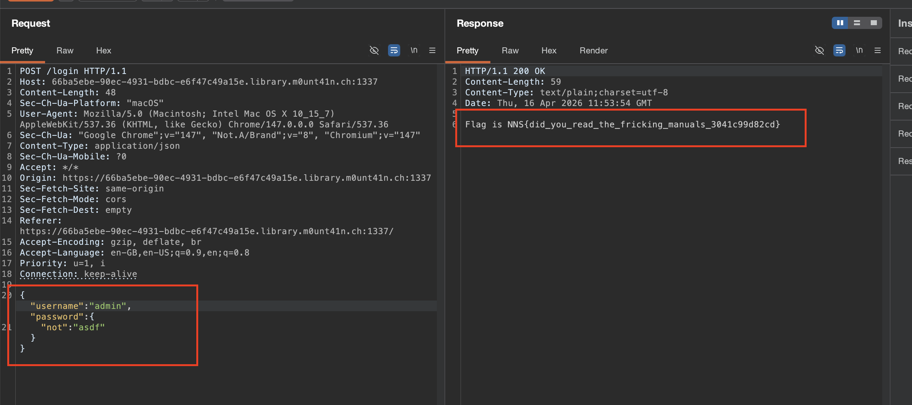

RTFM is a simple application that lets the user sign in and signup and it attaches the default role User to the registered user. When the user tries to login, they don't get the flag as the flag is only available to Admin roles only. 
Directly looking at the `index.ts`, we can see that if first creates an admin user, if there's no admin user.

The bug lies in the login itself, instead of sending the username, password as string, we will send an object that will help us bypass the auth because we will use property that exists in the prisma.
https://www.prisma.io/docs/v6/orm/prisma-client/queries/filtering-and-sorting
In this doc, we can see this:

The above code filters out the posts whose content is not null, similarly we will send a nested object that will check the admin users whose password doesn't exist in the db.

There we have it, the flag.